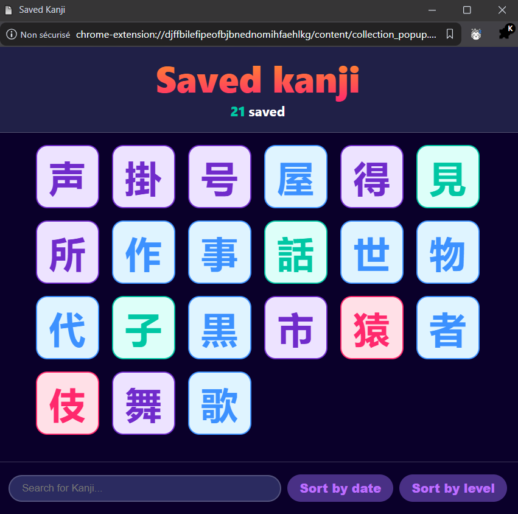
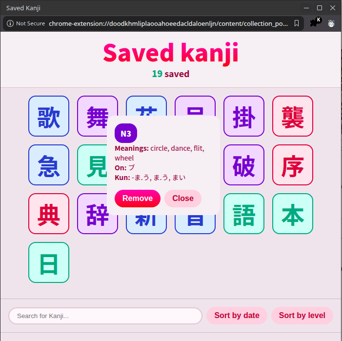
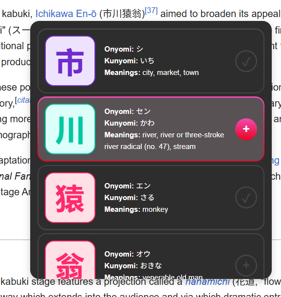
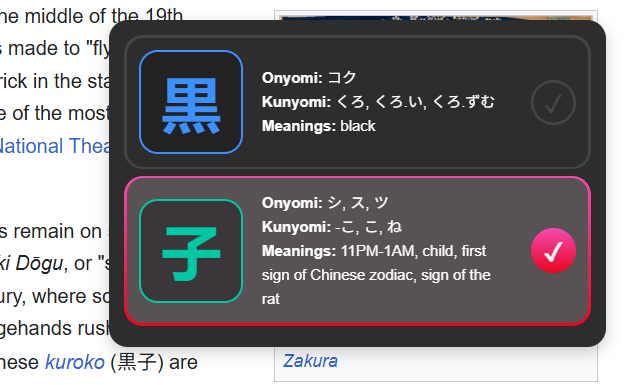

# Shirabeyou - Kanji Lookup Extension

This extension will allow you to select any text containing Kanji to get some quick information on their readings, meanings and JLPT level.Built as a portfolio project targeting the Japanese language learning ecosystem.

[Watch demo video](https://youtu.be/9hpsqcAc0_0)

  
  

## A little bit of background

As a long-time Japanese-learning app user, my goal making this extension is to fill a gap I have noticed in most of the services that I've used. Many will include the functionality to scan any Japanese-language website and give you a detailed breakdown of the vocabulary contained within, but what's often lacking is information on the individual kanji those words are made up of. It will typically be up to me to go on to a different tab and look the character up by myself... let's fix that!

## Features

  
  

- **Instant lookup** - highlight text containing kanji to trigger a popup with readings, meanings and JLPT level.
- **JLPT level color coding** - a-la Migaku.
- **Kanji collection** - save kanji for later review, sorted by saved date or JLPT level.
- **Reading search** - search your collection by on'yomi or kun'yomi reading in romaji, hiragana or katakana.
- **Theming** - Light or dark palettes.

All kanji data is fetched in real time from [kanjiapi.dev].

## Stack

**Extension**
- Vanilla JS, HTML/CSS - Manifest V3
- [kanjiapi.net](https://kanjiapi.net) for kanji data.
- [wanakana](https://github.com/WaniKani/WanaKana) for kana/romaji conversion.

**Backend**
- Node.js + Express REST API
- PostgreSQL - per-user kanji storage
- JWT authentication (bcrypt + jsonwebtoken)
- Deployed on Railway
- Jest + SuperTest - integration testing covering auth, kanji CRUD, input validation and rate limiting
- Rate limit and input validation on all endpoints (using Zod and express-rate-limit)

Backend repository: [kanji_extension_backend](https://github.com/danifer1695/kanji_extension_backend)

## Test it out!

Test credentials are **username: test@test.com, pass: password123**.

## Installation (in development)

1. Clone this repo
    git clone https://github.com/danifer1695/kanji_extension.git
2. Open `chrome://extensions` (or `vivaldi://extensions`... browser just has to be chromium-based)
3. Enable "Developer mode"
4. Click on "Load unpacked" and select the project folder

