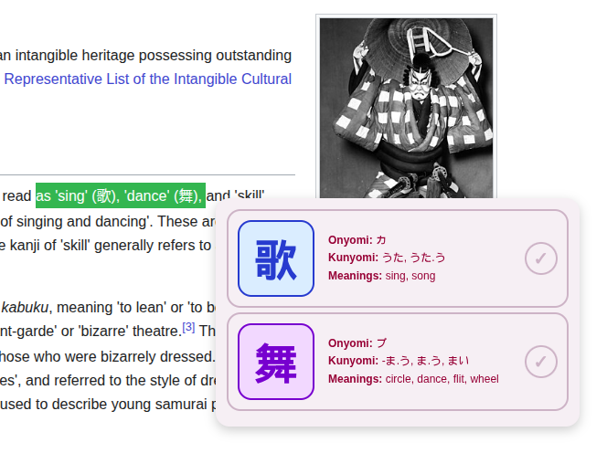
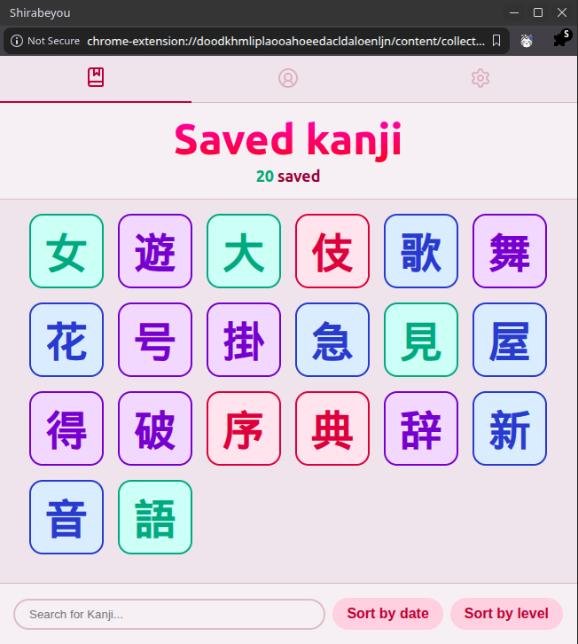
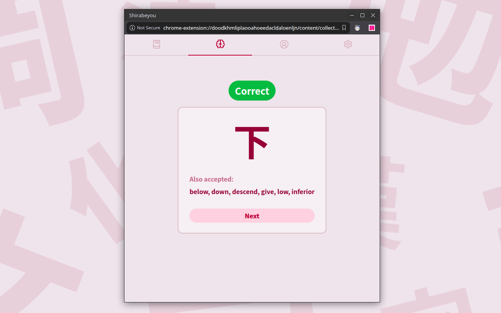

# Shirabeyou - Kanji Lookup Extension

Shirabeyou is a Kanji-learning platform that allows the user to lookup and save kanji characters. The platform is made up of a Chromium extension client - with which the user is able to lookup and save kanji on the go while browsing the web, plus a mobile client through which they can access their kanji collection remotely. Both clients include a learning tool to help the user master their kanji library through spaced repetition.
The UI is designed to be easy to navigate and fun to look at, displaying only the data that will be relevant to the user to avoid overwhelming them. Learning Japanese is hard enough! Additionally, both clients include a 'dark mode' for extra visual confort in low-light environments.

[Watch demo video](https://youtu.be/cdsfZPU8Vvg?si=u9a3i24_BQBo0eqf)

  

## Features

  
  

- **Instant lookup** - highlight text containing kanji to trigger a popup with readings, meanings and JLPT level.
- **SRS Learning** - Learn you saved kanji using Shirabeyou's spaced repetition learning tool.
- **Individual Account** - Create and manager your own Shirabeyou account. Your kanji library will follow you.
- **JLPT level color coding** - a-la Migaku.
- **Kanji collection** - save kanji for later review, sorted by saved date or JLPT level.
- **Reading search** - search your collection by on'yomi or kun'yomi reading in romaji, hiragana or katakana.
- **Theming** - Light or dark palettes.

## Stack

**Manifest V3 Extension**
- Vanilla JS, HTML/CSS - Manifest V3
- [kanjiapi.net](https://kanjiapi.net) for kanji data.
- [wanakana](https://github.com/WaniKani/WanaKana) for kana/romaji conversion.
- [Lucide](https://lucide.net) for UI icons.

**Companion Mobile App**
- TypeScript, React Native.
- Compatible with iOS & Android.
- "Search" tab to look any kanji up and add it to your collection (feature exclusive to Companion app).
- kanjiapi.net & wanakana used once again for Kanji data & kana/romaji conversion.

**Backend**
- Node.js + Express REST API
- PostgreSQL - per-user kanji storage
- JWT authentication (bcrypt + jsonwebtoken)
- Deployed on Railway
- Jest + SuperTest - integration testing covering auth, input validation and rate limiting
- Rate limit and input validation on all endpoints (using Zod and express-rate-limit)

Backend repository: [kanji_extension_backend](https://github.com/danifer1695/kanji_extension_backend)
Companion App repository: [Shirabeyou_app](https://github.com/danifer1695/Shirabeyou_app)

## Test it out!

Test credentials are **username: test@test.com, pass: password123**.

## Installation (in development)

1. Clone this repo
    git clone https://github.com/danifer1695/kanji_extension.git
2. Open `chrome://extensions` (or `vivaldi://extensions`... browser just has to be chromium-based)
3. Enable "Developer mode"
4. Click on "Load unpacked" and select the project folder

